

    

# Commodore 64 Breadbin

 

# Table of contents

<!-- TABLE OF CONTENTS -->

TOC - Click to enlarge

  <ul>
    <li>
      <a href="#starting-point">Starting point</a>
    </li>
    <li>
      <a href="#refurbishment-activities">Refurbishment activities</a>
    </li>
    <li>
      <a href="#disassembly">Disassembly</a>
    </li>
  </ul>

# Starting point

Yet another lovely Commodore 64 on the bench for some TLC! Does it work? I have no idea. Does it look beautiful? Yes, all Commodore 64 looks beautiful. But, yes, there are quite some dust, grease and yellowing.

There are some substantial *cable burn marks* on the top and bottom cover. These marks come as a result of soft cables, typically from a datasette, which has been wrapped around the machine during storage. It is not possible to remove these unfortunately, but some proper cleaning and retrobrighting should make it way better I think.

As mentioned I do not know if this machine work from the beginning, but it looks to be in good overall condition. Peeking from the outside, through the rear ports, I can see cobwebs and dust.

The keyboard also seems to be in good condition. Yes, it is very dirty, but beside that I can not see any mechanical damage to it.

Below are some pictures of the breadbin Commodore 64 before refurbishment.

    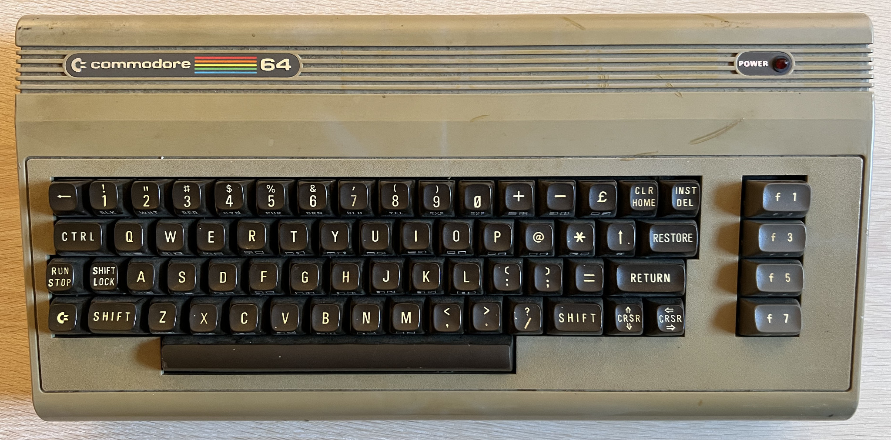
    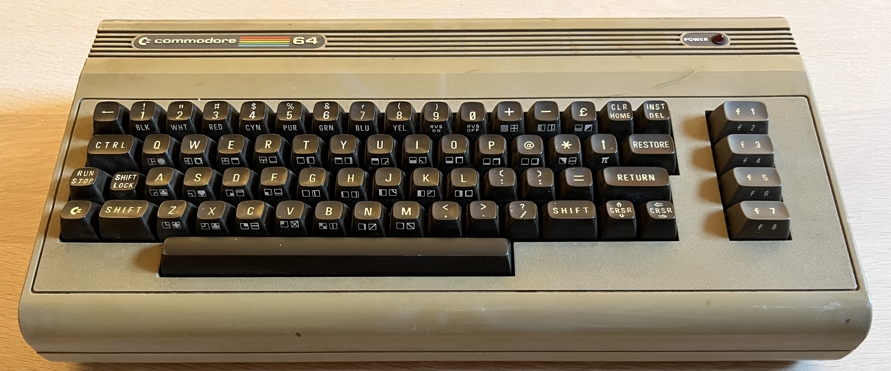
    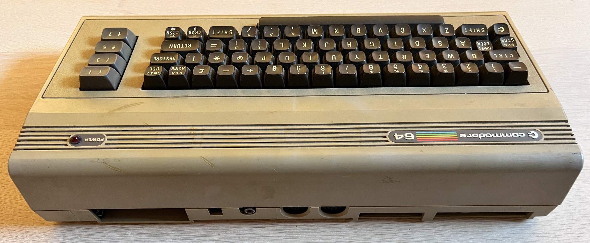
    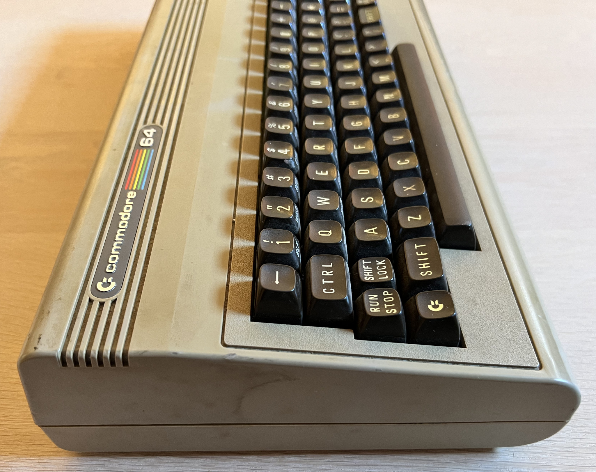
    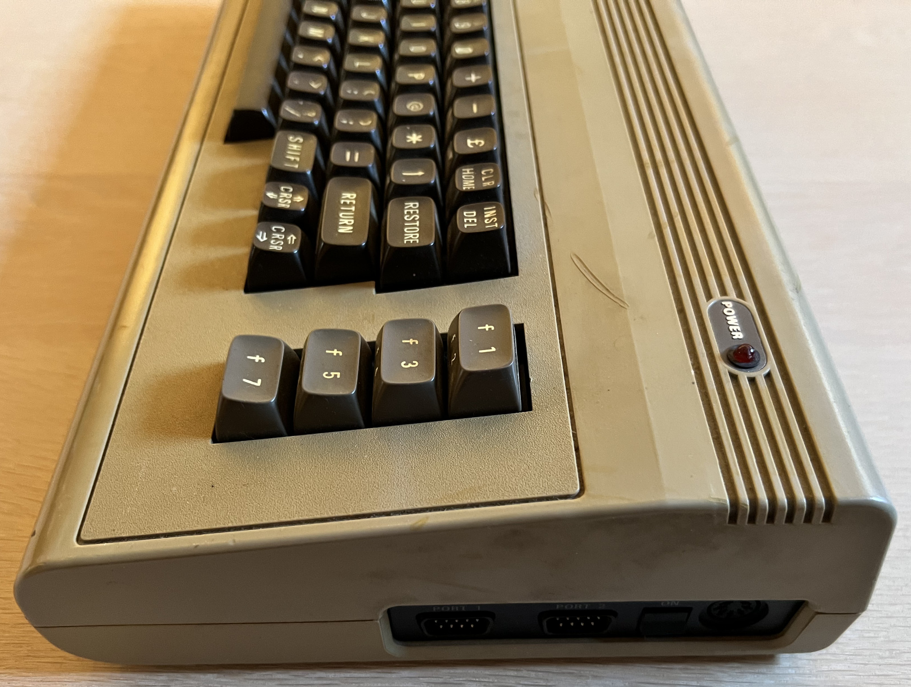
    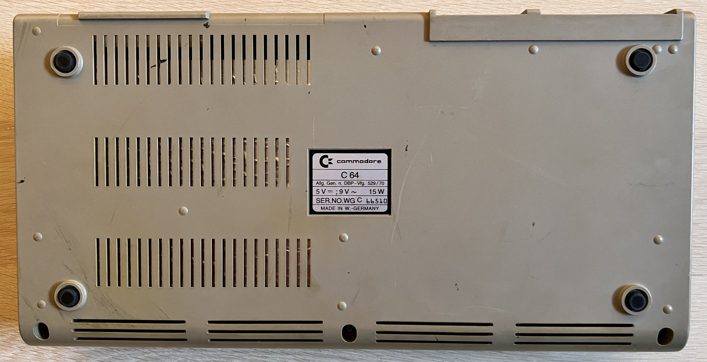

# Refurbishment activities

The planned refurbishment activites for this Commodore 64 (Order may vary. Several of them in parallel):

- [ ] Refurbish mainboard
- [ ] Refurbish the keyboard
- [ ] Refurbish the casing
- [ ] Testing and validation

The plan can be updated during the refurbishment process. Sometimes I discover areas that needs special attention.

<!-- MARK START -->

# Disassembly

The first step in the disassembly is to remove the three Phillips screws[^1] on the underside. These are considered to be the narrow type of screws for the breadbin model. I notice a faint, but nice, "cracking" sound from two of the screws when removed (using a low-torque screwdriver). This is a good sign—it may indicate that this machine has not been opened before. It is not guaranteed, but that "cracking" sound is often an indication that the screws have been sitting in place for many years.

    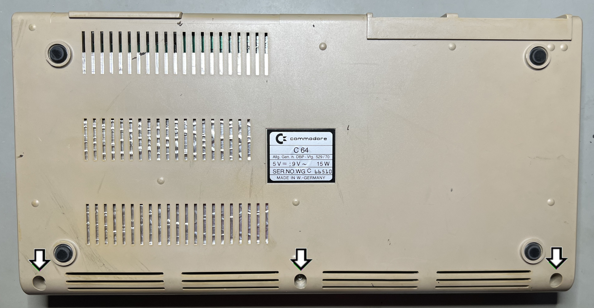

The machine is flipped over again, and the top cover is carefully lifted about 30 degrees and wiggled off. Now the interior is exposed and it appears to be in good condition. There are some dust (and small dead insects) close to the joystick port area. As can be seen from the picture below the cardboard RF-shield is wrinkled. But I do not think this is caused by extensive moisture. I think it is fair to assume that this Commodore 64 has been stored in a dry environment with relatively stable temperatures.

    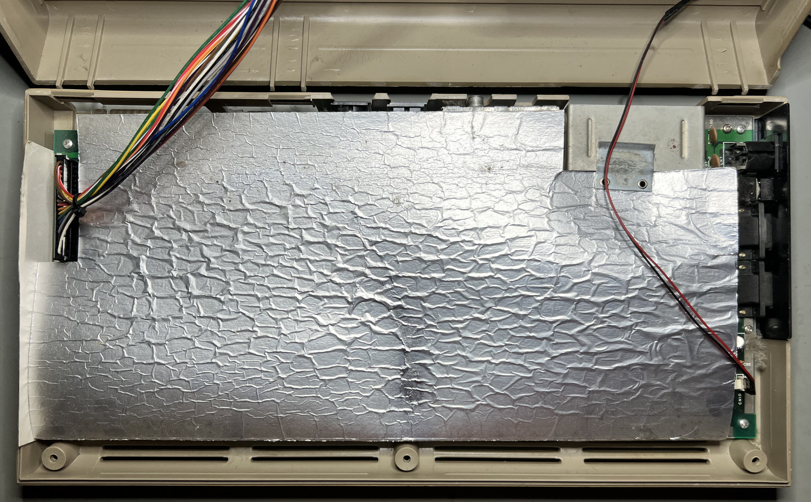

The rear plastic clips are in good condition—none of them are broken or missing. This is not something you see every day, as these are VERY fragile and will easily break. Further on, this is also pointing in the direction that this Commodore 64 has not been opened frequently, or not opened at all since manufactuing. Other models of the Commodore 64 casing have the more thick / rugged versions of these rear clips.

    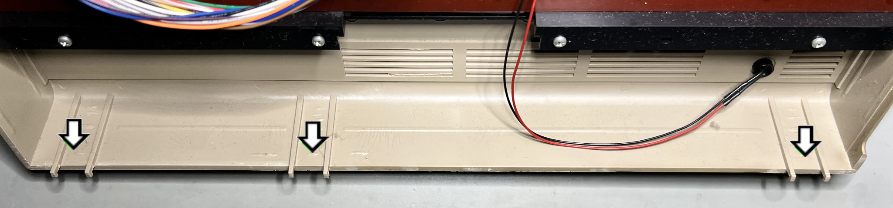

The cardboard RF shield is lifted away, and the PCB is exposed in all its glory. Several of the ICs are in socket, and the PCB appears to be in good general condition. There are some dust and grease inside - and also some proper cobwebs!

There are no signs of corrosion, neither on the PCB itself nor on the metal parts (VIC-II shield, cartridge connector, and RF modulator). This is another indication that this Commodore 64 has been stored in a dry, temperature-stable environment.  

All seven Phillips screws[^2] are in place, holding the PCB to the bottom cover. They are removed with a low-torque screwdriver to free the PCB from the bottom cover.

    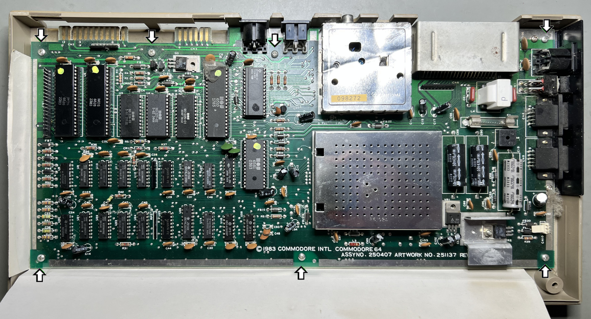

With the PCB out of the way, the inside of the bottom cover is visible. It seems to be in fine condition. 

    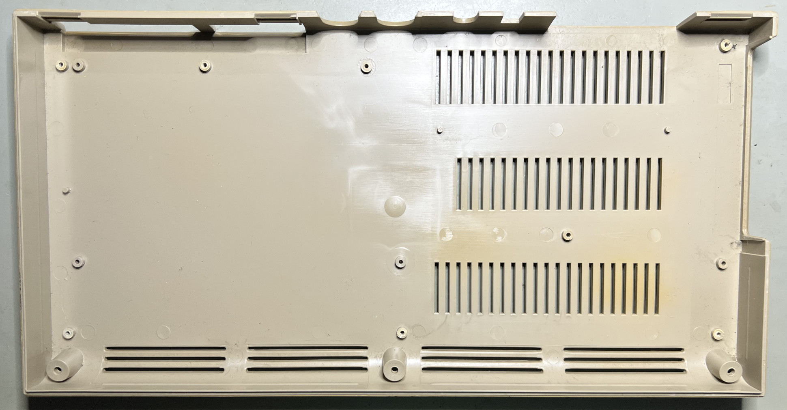

<!-- MARK STOP -->

**Footnotes**
[^1]: Phillips pan head (5.6 mm), Sheet metal screw, Fully threaded, Thread diameter: 3.0 mm, Fastener length: 9.0 mm
[^2]: Phillips pan head (5.5 mm), Sheet metal screw, Fully threaded, Thread diameter: 3.0 mm, Fastener length: 6.6 mm

