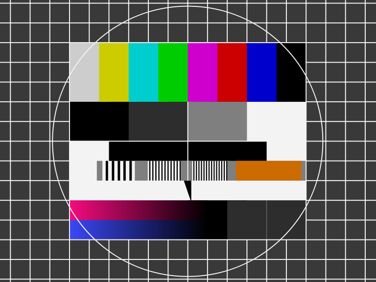

 

# Table of contents

<!-- TABLE OF CONTENTS -->

TOC - Click to enlarge

  <ul>
    <li>
      <a href="#starting-point">Starting point</a>
    </li>
    <li>
      <a href="#refurbish-activities">Refurbish activities</a>
    </li>
  </ul>

# Starting point

    

# Refurbish activities

The planned refurbishment activites for this Amiga 500 (Order may vary. Several of them in parallell):

- [ ] Refurbish the casing
- [ ] Refurbish the keyboard
- [ ] Refurbish mainboard
- [ ] Testing and validation

The plan can be updated during the refurbishment process. Sometimes I discover areas that needs special attention.
 

