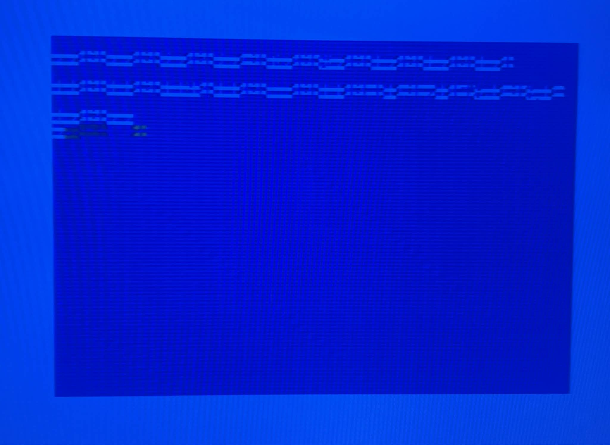
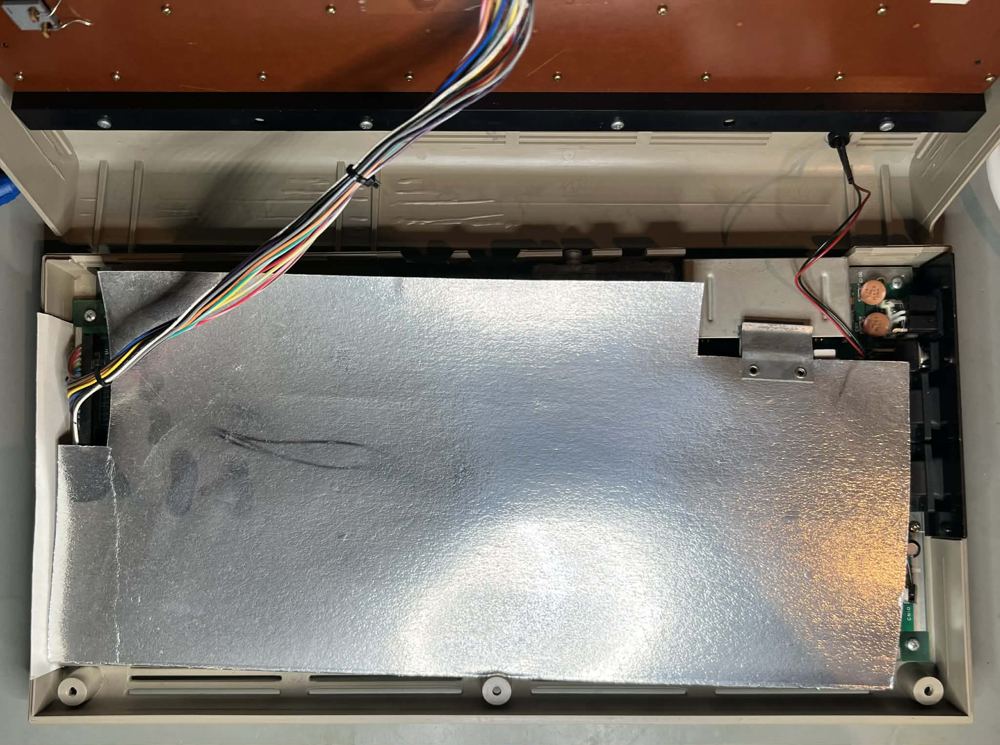
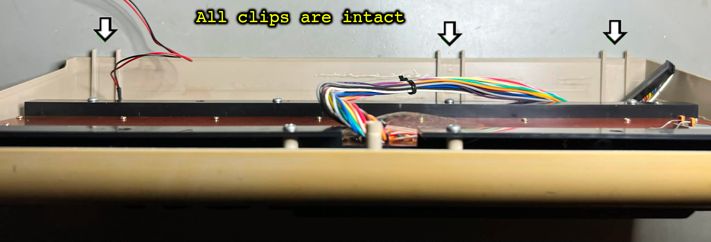

 

# Table of contents

<!-- TABLE OF CONTENTS -->

TOC - Click to enlarge

  <ul>
    <li>
      <a href="#starting-point">Starting point</a>
    </li>
    <li>
      <a href="#refurbish-activities">Refurbish activities</a>
    </li>
    <li>
      <a href="#initial-testing">Initial testing</a>
    </li>
  </ul>

# Starting point

This breadbin Commodore 64 has been sleeping in its original cardboard box for many years. But (luckily) it was found and will be taken care of by a fellow retro enthusiast. It is known to be not working, but hey, that´s just a challenge?

From the outside it appears to be complete without any damage. Yes, the "Commodore 64" metal badge is missing, but that should be easy to fix by sourcing a new one. All the keys seems to be fine, from a mechanical point of view. There is quite some dust and grease between, and below, the keycaps but that is to be expected from a machine which has been stored away several years.

Looking at the rear ports I can readily see that there is quite some dust inside (which is perfectly normal). Also, I notice that the datasette port is quite worn - so a fair guess is that this machine was used with a datasette for quite some time. The wear is caused by the datasette being inserted/removed frequently scratching the gold plated datasette port (CN3). 

There are som "burn" marks on the top rear and front side. These marks are most likely caused by either cables from the datasette, joysticks or power supply being wrapped around the machine when stored during its lifetime. You can follow the "burn" marks around the top- and front cover. Nevertheless, these marks are not severe in my opinion. Also, there are some paint residue, and some marks which I would guess is from a ball point pen.

The yellowing is quite severe, and varying in intensity in different areas on the top cover. All three Phillips screws at the bottom cover are present and does not show any signs of corrosion. There are no obvious signs that this machine was ever opened. So, who knows, maybe this is the first time opened for over 40 years?

Also, there is something I notice. There is a small "N" sticker at the bottom cover. This may of course be placed on the machine by the original owner, but could also be that Commodore placed this during manufacturing? This "N" sticker represents the Norwegian organisation "Nemko" which is a notified body for national electrical compliance. 

Below are some pictures of the machine before refurbish (click to enlarge).

    
    
    
    
    
    
    

# Refurbish activities

The planned refurbishment activites for this Commodore 64 (Order may vary. Several of them in parallell):

- [ ] Refurbish the casing
- [ ] Refurbish the keyboard
- [ ] Refurbish mainboard
- [ ] Testing and validation

The plan can be updated during the refurbishment process. Sometimes I discover areas that needs special attention.
 

# Initial testing

Before the refurbish commence, the Commodore 64 is connected to a TV set and powered on. This is to get an understanding of health of the machine. It is not meant as a complete test, but as an initial test.

The results are shown in the table below:

  
| Test area | Test criteria | Result | Comment |
|:----------|:----------|:----------:|:----------|
| Boot up | Default blue screen showing 38911 BASIC Bytes Free | FAILED | Garbled screen  Screen varies on each power on |
| DeadTest | Passing all tests | FAILED | Garbled screen |
| Diagostics Cartridge| Passing all tests | FAILED | Garbled screen  Screen varies on each power on|
| DesTestMAX | Passing all memory tests | FAILED | Garbled screen  Appears to be running|
| DesTestFULL | Passing all memory tests | FAILED | Garbled screen  Appears to be running|

Below are some pictures from the initial testing (click to enlarge).

**Boot up:**

    
    
    

**Dead test:**

    

**Diagnostics cartridge:**

    

**DesTestMAX:**

A video from the DesTestMAX test: https://youtu.be/WOMNB_J3-R4

**DesTestFULL:**

    

# Disassembly

Disassembling the Commodore 64 starts with removing the three Phillips screws from the bottom cover[^1].

    

The machine is flipped back to upright position, and the top cover is tilted/lifted about 30 degrees while wiggling it off from the bottom cover. It is important to do this carefully to avoid breaking the brittle plastic clips at the rear.

With the top cover lifted away the interior is revealed. As can be seen from the picture below the mainboard is covered with a cardboard RF-shield. The RF-shield seems to be in very good condition. This shield does not have any real function anymore - quite the opposite - it will only accumulate heat. So this shield will be removed during refurbish. But to see that the RF-shield is not damaged by moist is a good sign. This machine has probably been stored in a dry place with quite stable temperature.

    

Oh my... this warms my heart! None of the brittle plastic clips are broken! That is something I don´t see often. That said, I will try my best to be very, VERY, careful, but it is likely that some of these clips will break during cleaning since they are so brittle.

    

**Footnotes**
[^1]: Phillips pan head (5.5mm), Sheet metal screw, Fully threaded, Thread diameter: 3.0 mm, Fastener length: 10.0 mm
